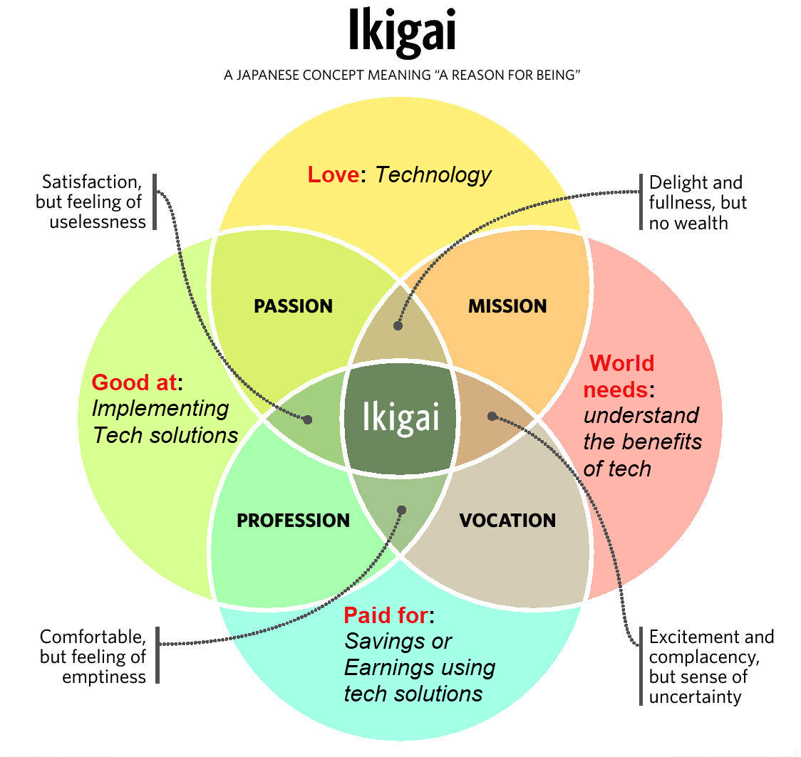

 

# Sam Banerjee

**Solution Architect &nbsp;·&nbsp; Program Lead &nbsp;·&nbsp; Founder, EdgeTech Cloud**

New York / New Jersey &nbsp;·&nbsp; <a href="https://edgetech.cloud">edgetech.cloud</a> &nbsp;·&nbsp; <a href="https://linkedin.com/in/samikbanerjee">linkedin.com/in/samikbanerjee</a> &nbsp;·&nbsp; <a href="https://github.com/SamBanerjee007">github.com/SamBanerjee007</a>

 

---

 

> *Most IT modernization fails the same way — too much scope, too little proof, too long before anyone sees results.*
>
> *I work the other side of that equation.*

 

Over **20 years**, I've delivered **120+ projects** across government, healthcare, and financial services — as hands-on architect, program lead, and trusted advisor. My edge isn't just technical fluency or leadership breadth. It's knowing how to do both at once, in high-stakes environments, with real accountability.

The organizations I work with aren't short on ambition. They're short on delivery. **EdgeTech** was built to fix that — AI-powered development, vendor-neutral advisory, quick-wins-first.

 

---

 

<table>
<tr>
<td width="50%" valign="top">

### WHAT I ARCHITECT

Cloud-native platforms, Real-time integration frameworks using HL7/FHIR, REST, event-driven
Enterprise modernization replacing legacy systems, zero data loss
AI-assisted development that compresses delivery timelines

</td>
<td width="50%" valign="top">

### WHAT I LEAD

Cross-functional teams of **60+** across IT, vendors, and policy staff
Program offices bridging engineers ↔ executives ↔ regulators
Multi-vendor governance (Accenture, KPMG, BCG, Salesforce, IBM, AWS)
Agile delivery — sprints, data-migration waves, automated UAT

</td>
</tr>
</table>

 

---

 

<table>
<tr>
<td align="center" width="25%"><h3>120+</h3>projects delivered</td>
<td align="center" width="25%"><h3>20+</h3>years in enterprise tech</td>
<td align="center" width="25%"><h3>35+</h3>trading partners integrated</td>
<td align="center" width="25%"><h3>6 wks</h3>vs. a 9-month timeline</td>
</tr>
</table>

 

---

 

### CURRENT WORK

**Founder & Managing Partner** — [EdgeTech Cloud](https://edgetech.cloud) &nbsp;`Sep 2020 – Present`

AI-powered rapid development and vendor-neutral advisory for healthcare and financial services leaders. Quick wins first. ROI before commitment.

**Executive Consultant / Sr. Technical Lead** — State of Rhode Island &nbsp;`Jan 2025 – Present`

Single point of contact for all technical systems in a federally mandated CCWIS modernization — replacing legacy child-welfare systems with a modular, cloud-native platform on Salesforce GovCloud, interoperating with 35+ state and federal trading partners in real time.

 

---

 

### THE INTERSECTION

*A few years ago I mapped out why I do what I do.*
*Technology isn't just what I'm good at — it's where passion, purpose, and impact converge.*

 

 

<strong>Love:</strong> Technology &nbsp;&nbsp;·&nbsp;&nbsp;
<strong>Good at:</strong> Implementing tech solutions &nbsp;&nbsp;·&nbsp;&nbsp;
<strong>Paid for:</strong> Delivering savings & earnings through tech &nbsp;&nbsp;·&nbsp;&nbsp;
<strong>World needs:</strong> Understanding the benefits of tech

 

---

 

<table>
<tr>
<td width="55%" valign="top">

### CREDENTIALS

`PMP` &nbsp; Project Management Professional
`CSM` &nbsp; Certified ScrumMaster
`AWS` &nbsp; Solutions Architect Associate
`MIT Sloan` &nbsp; AI: Implications for Business Strategy

**MS** Computer Science & Engineering — Distributed Databases
**BS** Computer Science — St. Xavier's College, Kolkata

</td>
<td width="45%" valign="top">

### DOMAIN FLUENCY

Salesforce GovCloud &nbsp;·&nbsp; AWS &nbsp;·&nbsp; Azure
HL7 / FHIR &nbsp;·&nbsp; REST APIs &nbsp;·&nbsp; Event-Driven Architecture
AI-Assisted Development &nbsp;·&nbsp; DevOps &nbsp;·&nbsp; Agile
Enterprise Integration &nbsp;·&nbsp; Data Migration
Healthcare IT &nbsp;·&nbsp; GovTech &nbsp;·&nbsp; FinTech

</td>
</tr>
</table>

 

---

 

**Wrestling with legacy systems, vendor lock-in, or stalled modernization?**

[ask@edgetech.cloud](mailto:ask@edgetech.cloud) &nbsp;&nbsp;·&nbsp;&nbsp; [edgetech.cloud](https://edgetech.cloud) &nbsp;&nbsp;·&nbsp;&nbsp; [LinkedIn](https://linkedin.com/in/samikbanerjee)

<em>I'll tell you what's actually possible in 90 days.</em>

 
